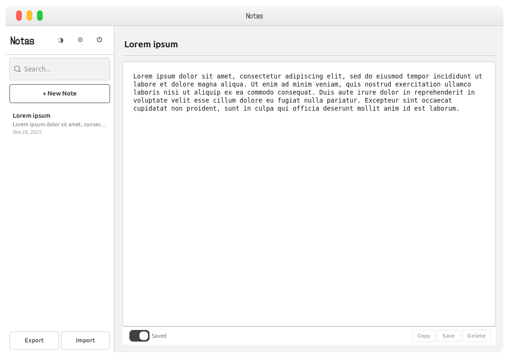

# Notas

<p align="center">

</p>

---

<p align="center">


</p>

---

<p align="center">


</p>

<p align="center">


</p>

---

A minimalist, pretty secure note-taking application for Linux. Built with Rust and GTK4, featuring AES-256 encryption and password protection at startup.


## Security

- **AES-256-GCM** encryption for all notes
- **Argon2id** key derivation (memory-hard, resistant to GPU attacks)
- **Auto-lock** after configurable timeout
- **Clipboard auto-clear** after copying sensitive content
- All data encrypted locally — nothing leaves your device

## Install

```bash
sudo dpkg -i notas_1.0.0_amd64.deb
```

## Font

Notas uses the DotGothic16 font. To install it:

```bash
./download-font.sh
```


## Uninstall

```bash
sudo apt remove notas
```

## License

Copyright © 2025 JEGLY. All rights reserved.

This software is provided for personal use only. Redistribution, modification, or commercial use of the source code is prohibited without written permission.
