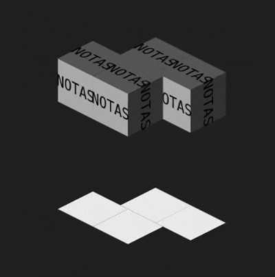
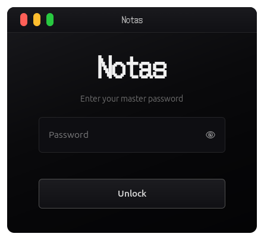
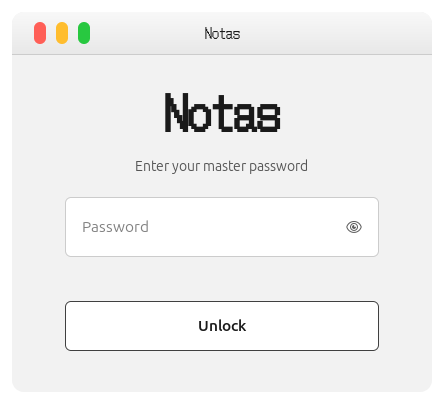
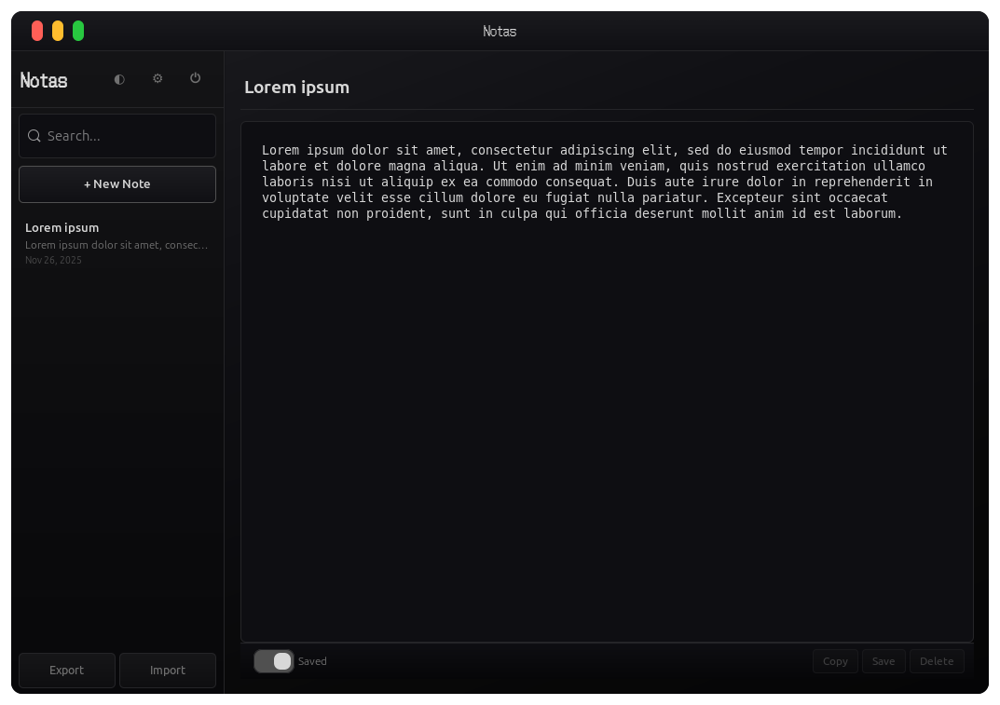
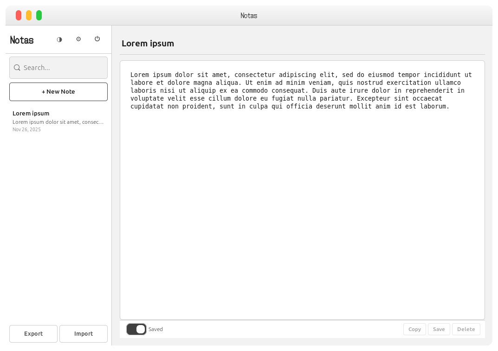

```
███╗   ██╗ ██████╗ ████████╗ █████╗ ███████╗
████╗  ██║██╔═══██╗╚══██╔══╝██╔══██╗██╔════╝
██╔██╗ ██║██║   ██║   ██║   ███████║███████╗
██║╚██╗██║██║   ██║   ██║   ██╔══██║╚════██║
██║ ╚████║╚██████╔╝   ██║   ██║  ██║███████║
╚═╝  ╚═══╝ ╚═════╝    ╚═╝   ╚═╝  ╚═╝╚══════╝
         SECURE NOTES  //  LINUX
```

<p align="center">

</p>

---

<p align="center">


</p>

---

<p align="center">


</p>

<p align="center">


</p>

---

```
┌─────────────────────────────────────────────────────────────────────────┐
│  A minimalist, secure note-taking application for Linux.                │
│  Built with Rust and GTK4.                                              │
│                                                                         │
│  AES-256 encryption and password protection at startup.                 │
│  Nothing leaves your device. No ads. No tracking. No internet.         │
└─────────────────────────────────────────────────────────────────────────┘
```

---

## INSTALL

```bash
sudo dpkg -i notas_2.1.0_amd64.deb
```

```
┌─────────────────────────────────────────────────────────────────────────┐
│  The DotGothic16 font is bundled and installed automatically            │
└─────────────────────────────────────────────────────────────────────────┘
```

---

## BUILD FROM SOURCE

```
┌─────────────────────────────────────────────────────────────────────────┐
│  REQUIREMENTS                                                           │
└─────────────────────────────────────────────────────────────────────────┘
```

```bash
sudo apt install pkg-config libgtk-4-dev libadwaita-1-dev rustup
```

```bash
./build-deb.sh
```

---

## SECURITY

```
┌─────────────────────────────────────────────────────────┬───────────────────────────────────────────────────┐
│  FEATURE                                                │  DETAIL                                           │
├─────────────────────────────────────────────────────────┼───────────────────────────────────────────────────┤
│  Encryption                                             │  AES-256-GCM for all notes                        │
│  Key derivation                                         │  Argon2id — memory-hard, GPU/brute-force resistant │
│  Salt                                                   │  Unique cryptographically random salt per vault   │
│  Nonce                                                  │  Fresh random nonce on every write, no reuse      │
│  Memory                                                 │  Decrypted content zeroed when app locks          │
│  Swap protection                                        │  mlock — key material pinned in RAM               │
│  Auto-lock                                              │  Configurable inactivity timeout                  │
│  Clipboard                                              │  Auto-clear after copying sensitive content       │
│  Uninstall                                              │  Vault and config wiped on removal                │
│  Network                                               │  Zero — nothing leaves your device                │
└─────────────────────────────────────────────────────────┴───────────────────────────────────────────────────┘
```

```
┌─────────────────────────────────────────────────────────────────────────┐
│  All data encrypted locally.                                            │
│  No ads / no tracking / no internet connectivity.                       │
└─────────────────────────────────────────────────────────────────────────┘
```

---

## UNINSTALL

```bash
sudo apt remove notas
```

```
┌─────────────────────────────────────────────────────────────────────────┐
│  User data is removed automatically on uninstall.                       │
│  A reinstall always starts clean.                                       │
└─────────────────────────────────────────────────────────────────────────┘
```

---

## LICENSE

```
┌─────────────────────────────────────────────────────────────────────────┐
│  MIT License                                                            │
│  Copyright (c) 2025 JEGLY. All rights reserved.                        │
│                                                                         │
│  Permission is hereby granted, free of charge, to any person           │
│  obtaining a copy of this software and associated documentation         │
│  files (the "Software"), to deal in the Software without restriction,  │
│  including without limitation the rights to use, copy, modify, merge,  │
│  publish, distribute, sublicense, and/or sell copies of the Software,  │
│  and to permit persons to whom the Software is furnished to do so,     │
│  subject to the following conditions:                                   │
│                                                                         │
│  The above copyright notice and this permission notice shall be         │
│  included in all copies or substantial portions of the Software.        │
│                                                                         │
│  THE SOFTWARE IS PROVIDED "AS IS", WITHOUT WARRANTY OF ANY KIND.       │
│  IN NO EVENT SHALL THE AUTHORS BE LIABLE FOR ANY CLAIM, DAMAGES OR     │
│  OTHER LIABILITY ARISING FROM USE OF THE SOFTWARE.                     │
└─────────────────────────────────────────────────────────────────────────┘
```
